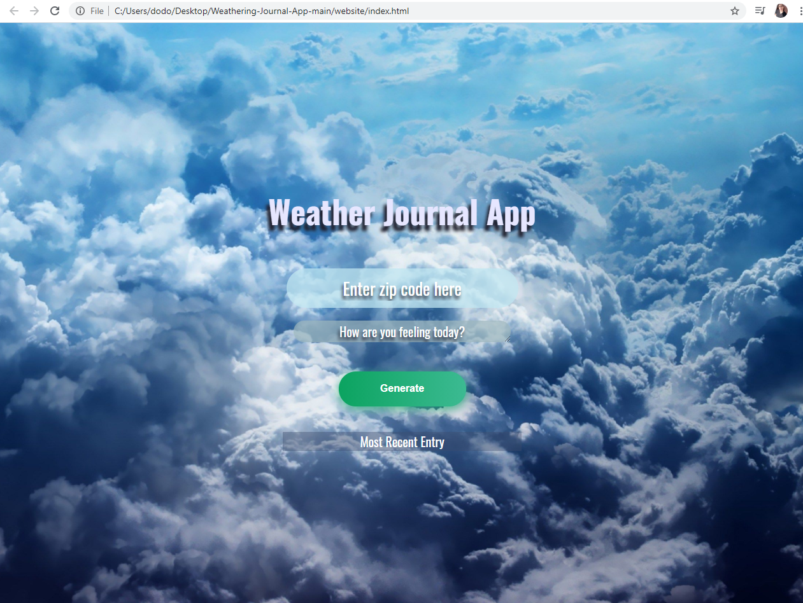

# Weather-Journal App Project

## Overview
The project is about a __*Weathering App*__ . It was about using APIs and asynchronous coding.
It works on using the API form OpenWeatherMap.org to get the temperetaure and the date for the present day.
The temperature is aquired through the Zip code of the city. Simply it goes to that zip code and get the temperature data, assign it in our local server and then update the UI with it for the client to see on __clicking__ the Generate button.

## Instructions
1. Enter your city Zipcode in the zip code specified box.
2. Enter how are you feeling according to the weather.
3. Click on the 'Generate' button
4. Check the 'Most Recent Entry' for the day weather data and how you feel beside it.
5. Enjoy reviewing my first app from 'Almost' scratch :').

